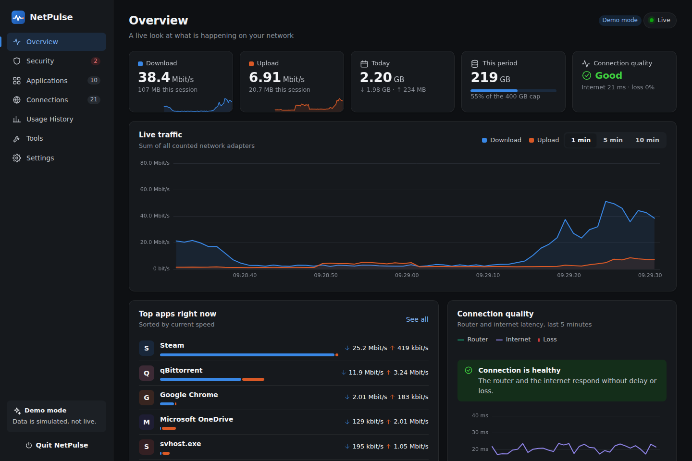
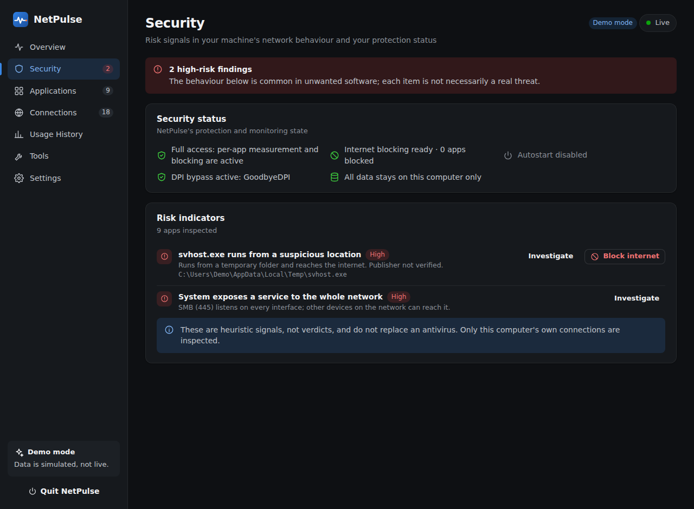
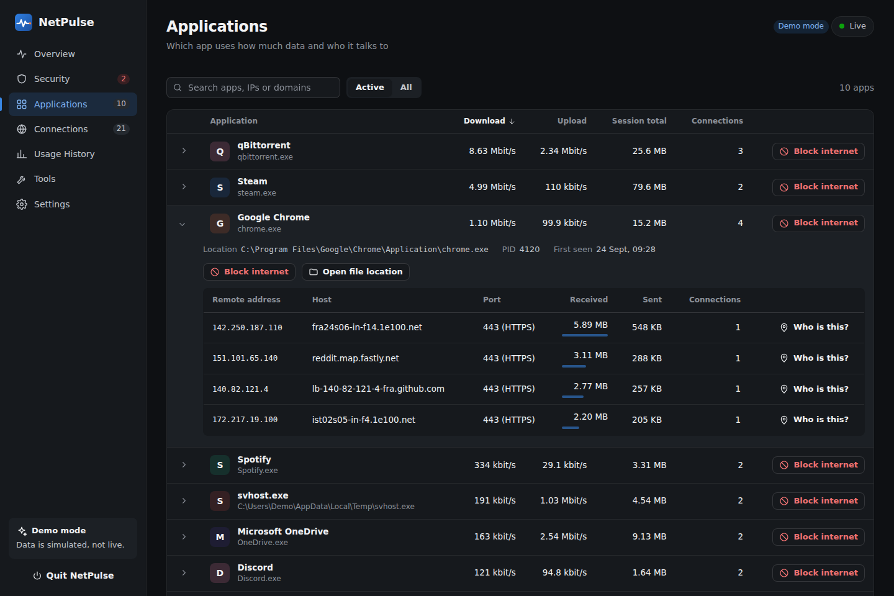
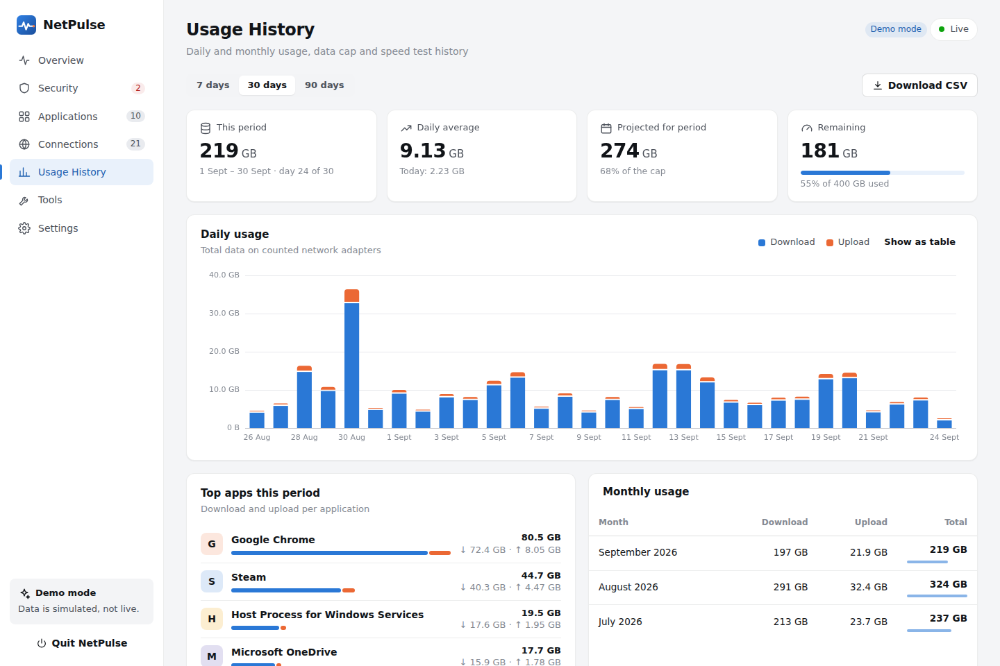
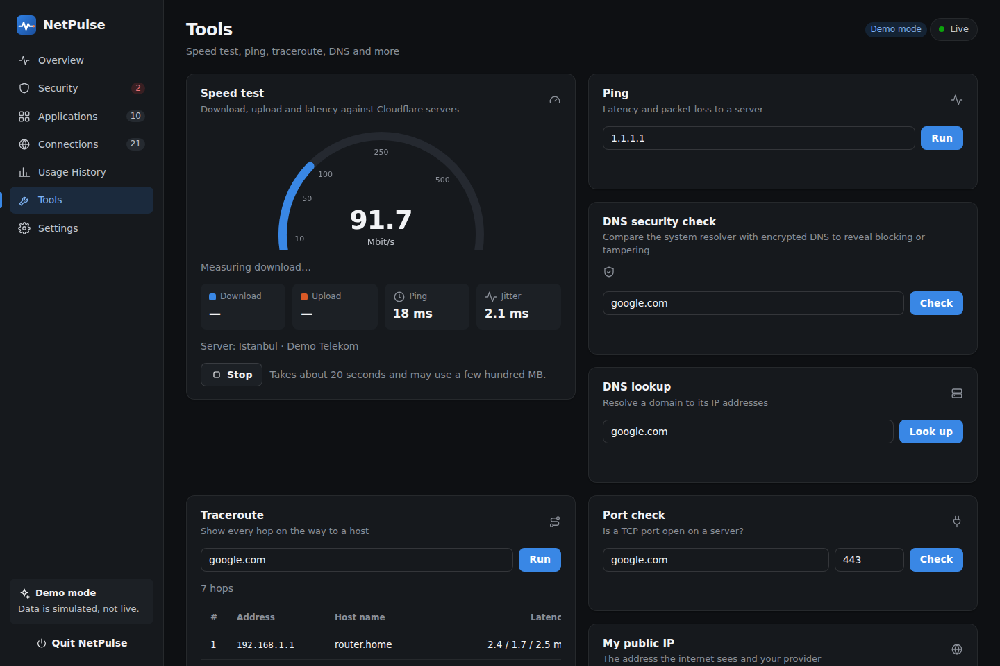
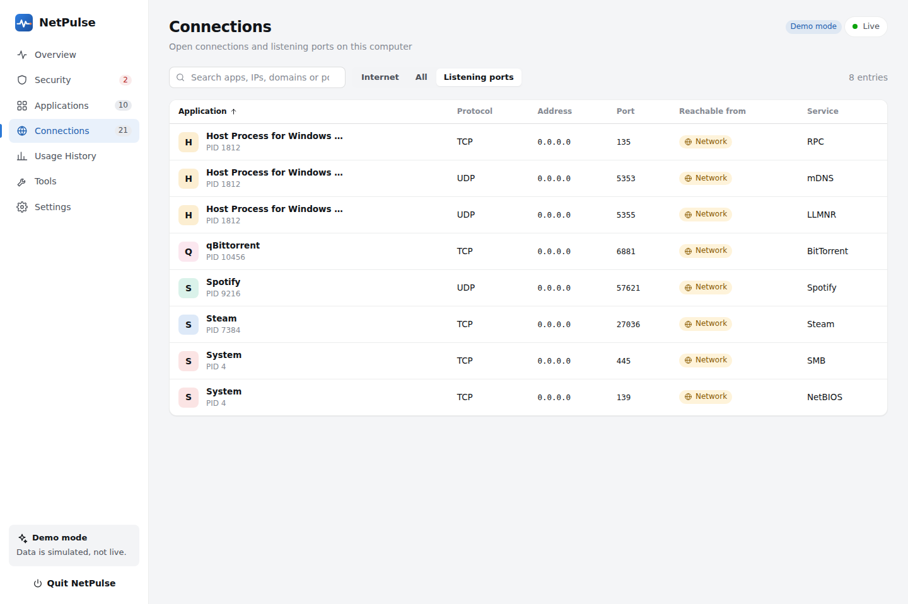
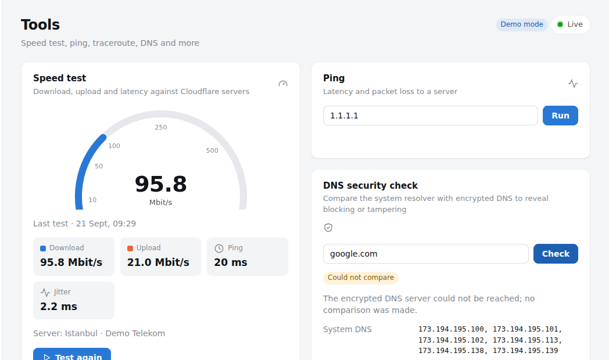

<p align="center">
  
</p>

<h1 align="center">NetPulse</h1>

<p align="center">
  <b>Per-application network monitor for Windows</b><br>
  See which program uses your internet, how much, who it talks to, and why your connection is slow — all on one screen.
</p>

<p align="center">
  <a href="https://github.com/kaanuunl/hi-/actions/workflows/ci.yml"></a>
  
  
  
</p>



## What it does

**Live monitoring**
- Instant download/upload speed with a chart of the last 1, 5 or 10 minutes
- **Per-application speed and totals:** the detail Task Manager never shows. Measured through Windows' kernel event tracing (ETW), with no driver to install.
- The servers, hostnames, ports and services each app connects to
- One-click IP owner lookup ("Who is this?")

**Security & threat triage**
- **Security screen:** inspects your own machine's network behaviour and lists patterns common to unwanted software as **risk indicators** — programs running from Temp/Downloads/Recycle Bin while reaching the internet, risky services exposed to the whole network (RDP/SMB/VNC), processes fanning out to very many hosts, and ports used by remote-access malware. These are heuristic signals, not verdicts; they complement, never replace, an antivirus, and only your own machine's connections are inspected.
- **Block an app's internet with one click** (a Windows Defender Firewall rule) and unblock it again. Critical system components and everything under `C:\Windows` are protected and can't be blocked.
- **First-seen application alerts:** helps you spot spyware and unwanted updaters.
- **Listening ports:** ports reachable by other devices on your network are flagged separately.
- **DPI-bypass (GoodbyeDPI) detection:** if you installed an anti-censorship tool yourself, its status is shown on the Security screen. *(NetPulse never bundles a packet-manipulation engine; it only detects one.)*
- **Hardened local API:** loopback-only, per-run token, `Host` check, strict CSP, and rate limiting on outbound tools.

**Connection quality & diagnostics**
- Continuous latency, jitter and packet-loss measurement to your router and to the internet
- **Automatic diagnosis:** tells you whether the problem is your Wi-Fi/router or your provider.
- **DNS security check:** resolves a name over both the system resolver and encrypted DNS (DoH) and compares them to reveal ISP-side blocking or redirection.
- Outage notifications and how long the outage lasted

**Usage & data caps**
- Daily, monthly and per-app usage history (chart and table)
- Monthly cap, billing-cycle start day, **end-of-period projection**, and 80% / 100% warnings
- CSV export

**Tools**
- **Speed test** (Cloudflare) with history: check whether you get the speed your provider promised.
- Ping, traceroute, DNS lookup, DNS security check, port check, public IP and provider info
- Network adapters, and which ones count toward usage (avoids double-counting on VPN/virtual adapters)

**Windows integration**
- Tray icon with live speed tooltip and Windows notifications
- Start with Windows (no UAC prompt in admin mode, via Task Scheduler)
- English and Turkish UI (English by default; switch in Settings); dark, light or system theme
- Single-file `.exe`, no installation required



| Applications | Usage history |
|---|---|
|  |  |
| **Tools** | **Listening ports** |
|  |  |



## Install

### Prebuilt program (recommended)

1. Download `NetPulse.exe` from the [Releases](https://github.com/kaanuunl/hi-/releases) page.
2. Double-click it. The dashboard opens in your browser and the icon appears in the system tray.
3. For per-app speed and internet blocking, click **Run as administrator** in the dashboard.

> For unsigned programs, Windows SmartScreen may show a "Windows protected your PC" warning. Choose **More info → Run anyway** to continue.

### From source

Requires [Python 3.9 or newer](https://www.python.org/downloads/).

```bat
git clone https://github.com/kaanuunl/hi-.git
cd hi-
run.bat
```

`run.bat` installs the one dependency (`psutil`) and starts the app. To run it manually:

```bat
py -m pip install -r requirements.txt
py run.py
```

### Build your own `.exe`

```bat
build_exe.bat
```

Output: `dist\NetPulse.exe`

## Usage

| Command | Description |
|---|---|
| `NetPulse.exe` | Starts and opens the dashboard. If already running, just opens the dashboard. |
| `--background` | Starts without opening the dashboard (used by autostart). |
| `--port 8765` | Dashboard port. If busy, the next free port is used. |
| `--console` | Runs in a console instead of the tray icon. |
| `--demo` | Runs with sample data instead of real traffic; for trying it out and demos. |
| `--selftest report.json` | Checks the environment and writes the result as JSON. Useful for bug reports. |

The dashboard is reachable only from this computer: `http://127.0.0.1:8765`.

### Why administrator rights?

Per-application traffic is read from Windows' **Microsoft-Windows-Kernel-Network** event source; Resource Monitor uses the same one. Listening to it and adding a firewall rule require administrator rights. Without them, total traffic, connections, connection quality, data caps and the tools still work. Applications are then listed by connection count.

## How it works

```
┌──────────────────────────── NetPulse.exe ─────────────────────────────┐
│  ETW (Kernel-Network) ──► per-application bytes                       │
│  psutil ────────────────► adapter counters, connections, processes    │
│  IcmpSendEcho ──────────► router / internet latency, traceroute       │
│  netsh advfirewall ─────► per-app blocking                            │
│            │                                                          │
│      Collector (1 s) ───► usage.json (%APPDATA%\NetPulse)              │
│            │            └► Threat engine (risk indicators)            │
│  DoH (DNS-over-HTTPS) ──► DNS tampering / censorship diagnosis        │
│            │                                                          │
│  HTTP API (127.0.0.1, per-run token, rate limit) ◄──► Dashboard      │
│  System tray ◄── events ──► Windows notifications                     │
└──────────────────────────────────────────────────────────────────────┘
```

- **One dependency:** `psutil`. The Windows integrations bind directly to Win32 APIs through `ctypes`. No Npcap, driver or extra service is needed.
- **The UI** uses no external libraries or CDNs; it works offline.
- **Data** lives in `%APPDATA%\NetPulse\usage.json` and is written atomically. If it is corrupted, it is backed up and rebuilt.

## Security & privacy

- No data leaves your machine. The only outbound requests come from tools you start yourself: speed test (Cloudflare), IP info (ipinfo.io), ping, traceroute, DNS and the DNS security check (Cloudflare DoH).
- The dashboard server listens only on `127.0.0.1`. Every request must carry a random per-run token embedded in the page; the `Host` header is checked and a strict CSP is applied, so other sites you visit can't reach the API (CSRF and DNS-rebinding protection). Outbound tool endpoints are rate-limited.
- Critical system components (`svchost.exe`, `lsass.exe`, `explorer.exe`, …) and every file under `C:\Windows` are protected and can't be blocked. Rules are created with the name `NetPulse block …` and can also be viewed and removed in Windows Defender Firewall.
- **Threat triage inspects only your own computer's connections**, never other devices on the network. Its findings are heuristic risk signals, not verdicts, and are not a substitute for an antivirus.

## FAQ

**Why are the numbers slightly different from Task Manager?**
By default NetPulse doesn't count virtual adapters (VPN, WSL, Hyper-V), because that traffic is already counted on the physical adapter. You can change this under **Tools → Network adapters**.

**Mbit/s or MB/s?**
Providers use Mbit/s (a 100 Mbit/s plan ≈ 12.5 MB/s download). Change the unit in **Settings**.

**My antivirus flags it.**
Unsigned programs packaged with PyInstaller are sometimes flagged by mistake. You can run from source with `run.bat` or build the `.exe` yourself.

**Does NetPulse do DPI bypass (GoodbyeDPI)?**
No. NetPulse does not contain a packet-manipulation kernel engine — that needs a fragile kernel driver and cannot work "flawlessly." Instead it **detects** a tool you installed yourself (GoodbyeDPI, zapret, …), shows its status on the Security screen, and complements it with the DNS security check.

**Is the Security screen a real antivirus?**
No. It heuristically flags suspicious patterns in your computer's network behaviour; it doesn't replace an antivirus, it's used alongside one.

**How do I remove it completely?**
Turn off autostart in Settings, delete the program, and optionally delete the `%APPDATA%\NetPulse` folder.

## Development

```bash
pip install -r requirements-dev.txt ruff
python -m pytest          # unit and integration tests
python -m ruff check .    # style checks
python run.py --demo      # develop the UI with sample data
```

Windows-specific code (ETW, firewall, ICMP, tray, autostart) is tested end to end on a real Windows machine in GitHub Actions on every push via `scripts/windows_smoke.py`. The same workflow builds the `.exe`, self-tests it, and publishes a release on `v*` tags (or from a manual **Run workflow** with a release tag).

```
agnabzi/
├── app.py            # command line, lifecycle, tray
├── collector.py      # 1 s sampling: rates, applications, events
├── threats.py        # threat triage (risk indicators)
├── storage.py        # usage history, settings, data caps
├── latency.py        # latency/loss measurement and diagnosis
├── api.py, server.py # local HTTP API (per-run token, rate limit)
├── speedtest.py, traceroute.py, netinfo.py  # tools + DoH/DNS diagnosis
├── windows/          # ETW, ICMP, firewall, tray, icons, autostart
└── web/static/       # dashboard (HTML, CSS, dependency-free ES modules)
```

## License

[MIT](LICENSE)
